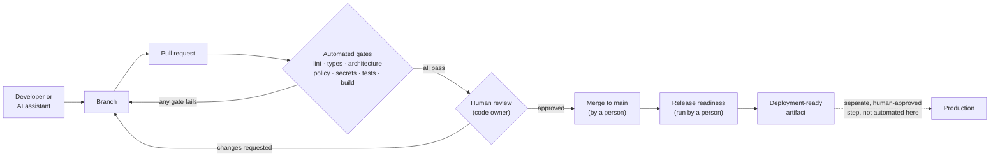

# ai-engineering-golden-path

[](https://github.com/ratchetnu/ai-engineering-golden-path/actions/workflows/ci.yml)

A small reference repository that shows one way to deliver software safely when
some of the code is written by an AI assistant.

The application is deliberately boring: a command-line task list. The
interesting part is everything around it: the checks a change has to pass, in
what order, and who has to approve it before it can be merged.

> **Core idea:** AI-generated code is not trusted automatically. It goes through
> the same path as human code: automated checks, then human review, then a
> person decides to merge. Nothing in this repository merges or deploys on its own.

**What this is:** a small, working reference project I built to show how I
approach delivery when AI coding assistants are involved.
**What this is not:** a production system, a copy of any employer's workflow,
or a claim that these exact tools run at a company. The application exists
only to give the checks something real to check.

```bash
npm ci
npm run verify            # every gate CI runs, in order
npm run demo:ai-violation # watch the architecture check reject AI-generated code (exits 1 on purpose)
```

Requires Node.js 22.18 or newer (see `.nvmrc`).

---

## Contents

1. [What this project demonstrates](#1-what-this-project-demonstrates)
2. [Why AI-assisted development needs controls](#2-why-ai-assisted-development-needs-controls)
3. [CI/CD in plain English](#3-cicd-in-plain-english)
4. [The golden-path workflow](#4-the-golden-path-workflow)
5. [Architecture rules](#5-architecture-rules)
6. [Testing strategy](#6-testing-strategy)
7. [Change-management strategy](#7-change-management-strategy)
8. [Separation of duties](#8-separation-of-duties)
9. [Example failure](#9-example-failure-ai-generated-code-caught-by-an-architecture-rule)
10. [Enterprise-scale extensions](#10-enterprise-scale-extensions)
11. [How this repository was built](#how-this-repository-was-built)

---

## 1. What this project demonstrates

A change travels a fixed, checked route from idea to a releasable build:

```
Requirement → implementation → pull request → automated checks (CI) → human review → approved merge → release-ready build
```

| Control | What it does in plain English | Where |
| --- | --- | --- |
| Lint | Catches common mistakes and risky patterns before a person reads the code | `eslint.config.js` |
| Strict type checking | The compiler refuses code where types don't line up, including "this might be undefined" cases | `tsconfig.json` |
| Tests | Unit, regression, architecture and tooling tests | `tests/` |
| Build verification | Compiles the app, checks nothing unexpected ships, then actually runs it | `tools/build-verification/` |
| Architecture check | Fails CI if code crosses a layer boundary the team agreed not to cross | `tools/architecture/` |
| Dependency policy | New packages need approval; versions must be pinned; licenses must be on an allow list | `tools/dependency-policy/`, `policy/` |
| Secret scan | Fails if anything that looks like a credential is about to be committed | `tools/secret-scan/` |
| PR validation | The pull request must say what changed, why, how it was tested, and whether AI was used | `tools/pr-validation/` |
| Release readiness | Confirms a commit is fit to hand to whoever approves deployment, and packages it | `tools/release-readiness/` |

Every check is a small, readable TypeScript file with its own tests, so you can
see exactly what it enforces. In a larger organisation you would swap several
of them for dedicated tools (see [section 10](#10-enterprise-scale-extensions)).

## 2. Why AI-assisted development needs controls

AI coding assistants are useful. They can write a first draft, suggest tests,
explain a failure, or refactor a function in seconds. This repository assumes
you will use them.

The problem is not that AI code is bad. It is that it is **confidently
plausible**. It usually compiles, often passes the tests it wrote for itself,
and reads well in a quick review. What it does not reliably know is the
unwritten context: why the team structured the code a certain way, which
shortcut caused problems before, which package was already ruled out.

So we treat AI like a fast, capable new contributor whose work is always
reviewed:

- **AI may** propose changes, write code, generate tests and analyse failures.
- **AI is not an authority.** Its output is a proposal.
- **Every change**, whoever or whatever wrote it, must pass deterministic
  checks, tests, architecture rules and human review.

The checks are useful precisely because they are boring: the same code always
gets the same answer. A type-checker or a test either passes or fails; it does
not have a good or bad day, and it cannot be talked into anything. (The
professional term is **deterministic validation**.) That is what makes the
checks trustworthy even when the code author is not.

More detail: [docs/ai-assisted-development.md](docs/ai-assisted-development.md).

## 3. CI/CD in plain English

**Checking every change automatically.** Every time someone proposes a change,
a server downloads the code, installs it from scratch and runs every check. If
any check fails, the change is marked red. With branch protection turned on
(see [section 7](#7-change-management-strategy)), a red change cannot be
merged. This stops "it works on my machine" and means nobody can quietly skip
a check. *Professional term: **continuous integration (CI)**.*

**Always being ready to release.** The main branch is kept in a state that
*could* be released at any time. A release step can take a commit on main,
confirm it is ready, and produce a package that is ready to deploy.
*Professional term: **continuous delivery (CD)**.*

This repository goes as far as **"ready to deploy"** and deliberately stops.
Actually deploying is a separate decision made by a person who is accountable
for production. That boundary is intentional: see
[section 8](#8-separation-of-duties).

| Workflow | When it runs | What it does |
| --- | --- | --- |
| [`ci.yml`](.github/workflows/ci.yml) | Every pull request and every push to `main` | Runs the six gates, then a single **CI result** check that summarises them |
| [`pr-validation.yml`](.github/workflows/pr-validation.yml) | When a PR is opened or edited | Checks the PR title and description |
| [`release-readiness.yml`](.github/workflows/release-readiness.yml) | Manually, on `main` only | Re-runs every gate, checks release prerequisites, uploads a build artifact with checksums. **Does not deploy.** |

Each gate is a separate job, so the pull request page reads like a checklist:

```
✅ Gate 1 · Lint
✅ Gate 2 · Typecheck (strict)
❌ Gate 3 · Architecture rules        ← click to see which file and how to fix it
✅ Gate 4 · Dependency policy & secret scan
✅ Gate 5 · Tests (unit, regression, architecture, tooling)
✅ Gate 6 · Build & verify output
❌ CI result
```

Failures also show up as inline annotations on the exact line of the pull
request diff.

## 4. The golden-path workflow

There is one supported, well-lit route for getting a change in. You *could*
go around it, but staying on it is the easiest option, and the checks along
the way catch mistakes early. *Professional terms: a **golden path** or
**paved road**.*



Plain-text version:

```
 AI / developer
      │  writes code on a branch
      ▼
   branch ──────────────► pull request
                               │
                               ▼
              ┌─────── automated gates ────────┐
              │ 1 lint        4 deps + secrets │   any failure
              │ 2 types       5 tests          │ ─────────────► back to the branch
              │ 3 architecture 6 build + smoke │
              └────────────────┬───────────────┘
                               │ all green
                               ▼
                         human review  ── changes requested ──► back to the branch
                               │ approved by a code owner
                               ▼
                       merge (a person clicks it)
                               │
                               ▼
                 release readiness (a person runs it)
                               │
                               ▼
                    deployment-ready artifact
                               ┆
                               ┆  separate, human-approved promotion
                               ▼  (deliberately not automated here)
                           production
```

Step by step:

1. **Requirement.** An issue describes what is needed and why.
2. **Implementation.** A developer, an AI assistant, or both, write the change
   on a branch. Running `npm run verify` locally gives the same answer CI will.
3. **Pull request.** The template asks what changed, why, how it was verified
   and how much AI was involved.
4. **Automated gates.** CI runs every check. Red means stop.
5. **Human review.** A code owner reads the change. CI proves the code meets
   the rules; the reviewer judges whether it is the *right* change.
6. **Merge.** Only after green CI and an approval. A person merges it.
   There is no auto-merge.
7. **Release readiness.** A person triggers the release workflow on `main`. It
   produces a versioned, checksummed artifact. Deploying it is a separate
   decision.

## 5. Architecture rules

The app has four layers and one wiring file:

```
src/
├── main.ts          composition root: wires everything together
├── cli/             command-line interface  → may use services, domain
├── services/        application use cases   → may use persistence, domain
├── persistence/     storage (JSON file)     → may use domain
└── domain/          business rules          → may use nothing
```

The main rule:

> **Only the persistence layer may touch storage directly.** Every other part of
> the code reads and writes tasks through it.

If another module imports `node:fs` (or `node:sqlite`, etc.) to read the data
file itself, CI fails.

Three supporting rules are checked the same way:

- Layers may only depend in the allowed direction (the CLI may not reach into
  persistence; the domain may not depend on anything).
- Other layers import a layer through its `index.ts`, not its internal files.
- Every source file must belong to a known layer, so new code cannot quietly
  sit outside the rules.

**We don't just tell developers to follow this rule. The repository checks the
rule automatically.** A rule that lives only in a wiki page or a reviewer's
head gets broken under deadline pressure, and an AI assistant has never read
the wiki. A rule that is checked on every pull request cannot be forgotten.

### What the check does, without reading any code

Think of it as an inspector that reads the top of every file, where the file
lists what it uses, and compares that list against the agreed floor plan.

| If a file in… | uses… | the check says |
| --- | --- | --- |
| `persistence/` | the file system | ✅ Fine. This is the one place allowed to. |
| `services/` | `persistence/` (through its front door, `index.ts`) | ✅ Fine. |
| `cli/` | `services/` | ✅ Fine. |
| `cli/` | the file system | ❌ **Fail:** "Only persistence may access storage directly." |
| `cli/` | `persistence/` | ❌ **Fail:** "cli may not import persistence. cli may import: domain, services." |
| `services/` | a file *inside* `persistence/` instead of its front door | ❌ **Fail:** "import a layer through its index.ts." |
| a new folder nobody planned for | anything | ❌ **Fail:** "Every source file must belong to a known layer." |

When it fails, CI goes red and the message names the file, the line, the rule
that was broken and how to fix it. Someone can still change the rule, but only
by editing the rule file in a pull request that explains why and that the code
owner approves. The rule cannot be bypassed silently.

The same check runs twice: once as a readable report
(`npm run check:architecture`) and once as automated tests that also feed in
deliberately bad code to prove each rule really fires.

*Professional term:* a check that enforces a design decision like this is
called an **architectural fitness function**: it measures whether the code
still "fits" the architecture that was chosen. Together with templates,
defaults and CI that make the right way the easy way, it is part of what
people mean by a **paved road** or **golden path**.

How it works under the hood: [`tools/architecture/check.ts`](tools/architecture/check.ts)
uses the TypeScript compiler to list every `import`, `export … from`,
`import()` and `require()` in `src/`, and compares them against the rules in
[`tools/architecture/rules.ts`](tools/architecture/rules.ts), which are plain
data a reviewer can read in a minute. The decision and its trade-offs are
recorded in [ADR-0001](docs/adr/0001-single-persistence-module.md); more
detail in [docs/architecture-rules.md](docs/architecture-rules.md).

## 6. Testing strategy

Different tests answer different questions:

| Kind | Question it answers | Example |
| --- | --- | --- |
| **Unit tests** | Does this piece behave correctly on its own? | `tests/unit/` — domain rules, service use cases, file storage, CLI output |
| **Regression tests** | Has a bug we already fixed come back? | `tests/regression/reg-001-complete-twice.test.ts` |
| **Architecture tests** (fitness functions) | Does the code still follow the agreed structure? | `tests/architecture/` |
| **Tooling tests** | Do the guardrails themselves work, including catching bad input? | `tests/tools/` |
| **Smoke test** | Does the built program actually start and do its job? | `tools/build-verification/verify.ts` runs `help → add → list → stats` against the compiled output |

Principles:

- **Tests are fast and repeatable.** The clock and ID generator are injected,
  so tests never depend on the time of day or random values.
- **A bug fix starts with a failing test.** The regression test is written
  first, fails, then the fix makes it pass, and it stays forever. (REG-001 is
  an illustrative bug for this project.)
- **The guardrails are tested too.** Every check has tests showing it catches
  the problem it claims to catch. A check nobody has seen fail is a check
  nobody should trust.
- **Business logic is tested without the file system.** Services use an
  in-memory store in tests. This is only easy *because* of the architecture
  rule in section 5.

## 7. Change-management strategy

Plain English: every change is proposed, written down, checked, approved by a
person, and can be traced afterwards. *Professional term: **change
management**.*

| Practice | How this repository does it |
| --- | --- |
| Every change goes through a pull request | Branch protection on `main`, configured in GitHub settings (see [docs/branch-protection.md](docs/branch-protection.md)) |
| Changes are described consistently | PR template + `pr-validation` check; [Conventional Commits](https://www.conventionalcommits.org/) titles |
| AI involvement is disclosed | Required tick-box in the PR template, checked automatically |
| Changes to the guardrails get extra scrutiny | Editing `tools/`, `policy/`, `.github/` or lint/type config requires a written justification and code-owner approval |
| Builds are reproducible | Exact dependency versions, committed lockfile, `npm ci`, Node version pinned in `.nvmrc` |
| Releases are traceable | Release manifest records version, commit SHA, Node version and a SHA-256 checksum of every shipped file |
| Releases are explicit | Version bump and `CHANGELOG.md` entry are required; the same version cannot be released twice |
| Dependency updates are routine | Dependabot opens weekly update PRs that go through the same gates and review |

## 8. Separation of duties

Plain English: **the person (or tool) that writes a change should not be the
only one who approves it, and the system that builds it should not be the one
that decides to ship it.** *Professional term: **separation of duties**.*

| Role | Can | Cannot |
| --- | --- | --- |
| AI assistant | Propose code, tests and fixes; explain failures | Approve, merge, change branch protection, deploy |
| Author (developer) | Open PRs, push to their branch, run checks locally | Approve their own PR, push directly to `main` |
| CI | Run checks, report results, build artifacts | Merge, deploy, change its own rules |
| Reviewer / code owner | Approve or request changes; approve guardrail changes | Skip CI |
| Release approver | Decide whether a ready artifact goes to production | — (outside this repository) |

Key points:

- **Writing and approving are separate.** GitHub does not let a PR author
  approve their own PR; in a team, branch protection requires an approval from
  someone else. (This public repository has a single maintainer, so here the
  separation is between the AI assistant that proposes code and the person who
  reviews and merges it. See [docs/branch-protection.md](docs/branch-protection.md).)
- **Changing the rules is itself a reviewed change.** The architecture rules,
  dependency policy and CI config are owned in `CODEOWNERS`.
- **CI has the least access it needs.** Workflows run with
  `permissions: contents: read`, no deployment credentials and no write
  access to the repository.
- **Building and deploying are separate.** The release workflow stops at
  "deployment-ready artifact". There is no automatic merging and no automatic
  production promotion anywhere in this repository.

## 9. Example failure: AI-generated code caught by an architecture rule

> This change was **rejected and never merged**. It is a representative
> AI-style change written for this repository to demonstrate the check, not a
> record of a real incident.

**The request:** "Add a `stats` command that shows how many tasks are open and
done."

**The proposed change** ([full diff](docs/examples/ai-generated-violation.diff)):

```diff
+import { readFileSync } from 'node:fs';
+import { join } from 'node:path';
 ...
       case 'stats': {
-        const stats = await service.stats();
-        out.log(`open: ${stats.open}  done: ${stats.done}  total: ${stats.total}`);
+        // Read the file directly: simpler than going through the service.
+        const file = process.env['TASKS_FILE'] ?? join(process.cwd(), '.tasks.json');
+        const tasks = JSON.parse(readFileSync(file, 'utf8')) as Task[];
+        const done = tasks.filter((t) => t.completedAt !== null).length;
+        out.log(`open: ${tasks.length - done}  done: ${done}  total: ${tasks.length}`);
```

It is short, readable, and it works: when we built it and ran it for real, the
smoke test (`help → add → list → stats`) passed. Lint passed. The strict type
check passed.

**What the pipeline said:**

```
FAIL  Architecture rules: 1 problem(s) found

  1. src/cli/cli.ts:1  [storage-access] import "node:fs"
     Only persistence may access storage directly. The cli layer imports "node:fs".
     How to fix: Add or reuse a method on a service (src/services) that goes
     through the TaskStore interface in src/persistence, and call that instead.
```

**Why it matters even though it works:** the CLI now has its own copy of the
storage format and file location. It skips the validation in `FileTaskStore`,
breaks if storage moves to a database, and cannot be tested without a real
file. None of that is visible in a quick review, and the AI had no way to know
the team's rule. The check knew.

**What happened next:** the change was not merged. **The accepted version** adds `TaskService.stats()` and a pure `summarize()`
function in the domain, and the CLI calls the service. That is what is in
`src/` today.

The rejected code is kept, under a large "REJECTED EXAMPLE - DO NOT COPY"
banner, in
[`tests/fixtures/ai-generated-violation/`](tests/fixtures/ai-generated-violation/),
and a test proves the check keeps catching it. Full walkthrough, including
which other gates did and did not notice:
[docs/examples/ai-generated-violation.md](docs/examples/ai-generated-violation.md).

## 10. Enterprise-scale extensions

This repository is intentionally small, and **none of the items in the right-hand
column are implemented here**. They are the directions the same ideas
commonly take in larger organisations, listed to show where each simple piece
would go next:

| Here | At scale |
| --- | --- |
| Hand-written architecture checker | [dependency-cruiser](https://github.com/sverweij/dependency-cruiser), ArchUnit (JVM), Nx module boundaries, or Bazel visibility rules; shared rule sets across repositories |
| Regex secret scanner | GitHub secret scanning with push protection, gitleaks or trufflehog, plus a documented credential-rotation runbook |
| JSON dependency allow list | Software composition analysis (Dependabot alerts, Snyk, OSV-Scanner), a private package registry/proxy, an SBOM (CycloneDX/SPDX) attached to each release |
| `CODEOWNERS` with one owner | Team-based ownership, required reviews from security for sensitive paths, organisation rulesets that repositories cannot override |
| Release readiness script | Signed, provenance-attested builds (Sigstore / SLSA), immutable artifact storage, environment promotion through GitHub Environments with required reviewers, change tickets linked to releases |
| Actions referenced by version tag | Actions pinned to full commit SHAs, an internal allow list of approved actions, OpenID Connect instead of stored cloud credentials |
| One workflow file | Reusable workflows maintained by a platform team, so every repository gets the golden path by default |
| Local test suite | Contract tests between services, mutation testing to measure test quality, ephemeral preview environments |
| PR disclosure tick-box | Policy on which AI tools are approved, logging of AI-assisted changes, periodic audits that sample AI-assisted PRs |
| Manual monitoring | Deployment health checks, automatic rollback, DORA metrics (lead time, change failure rate) to see whether the controls help or just slow things down |

The principle does not change with scale: **make the safe path the easy path,
check the rules automatically, and keep a human accountable for what merges
and what ships.**

---

## Repository map

```
.github/
  workflows/ci.yml                 six gates + summary
  workflows/pr-validation.yml      PR title/description check
  workflows/release-readiness.yml  manual, main only, no deploy
  actions/setup/                   shared Node + npm ci setup
  CODEOWNERS                       who must review what
  pull_request_template.md
  dependabot.yml
docs/
  ai-assisted-development.md
  architecture-rules.md
  branch-protection.md
  adr/0001-single-persistence-module.md
  examples/ai-generated-violation.md (+ .diff)
policy/dependency-policy.json
src/                               the deliberately simple app
tests/                             unit, regression, architecture, tooling, fixtures
tools/                             the guardrails, each with tests
```

| Command | What it does |
| --- | --- |
| `npm run verify` | Everything CI runs, in order |
| `npm run lint` / `typecheck` / `test` / `build` | Individual gates |
| `npm run check:architecture` | Architecture rules |
| `npm run check:dependencies` | Dependency policy |
| `npm run check:secrets` | Secret scan |
| `npm run verify:build` | Inspect `dist/` and run the smoke test |
| `npm run check:pr -- --title "…" --body-file pr.md --base main` | Validate a PR description locally |
| `npm run release:check` | Release readiness (on a clean `main`) |
| `npm run demo:ai-violation` | Run the architecture check against the rejected AI change |

## How this repository was built

I wrote this repository with help from an AI coding assistant, under the same
rules it describes: the assistant proposed code and documentation, the
automated checks in this repository had to pass, and I reviewed the result and
decided what to keep. Commits that had AI help say so in a `Co-Authored-By`
line. Nothing was merged or published automatically.

## License

[MIT](LICENSE)
