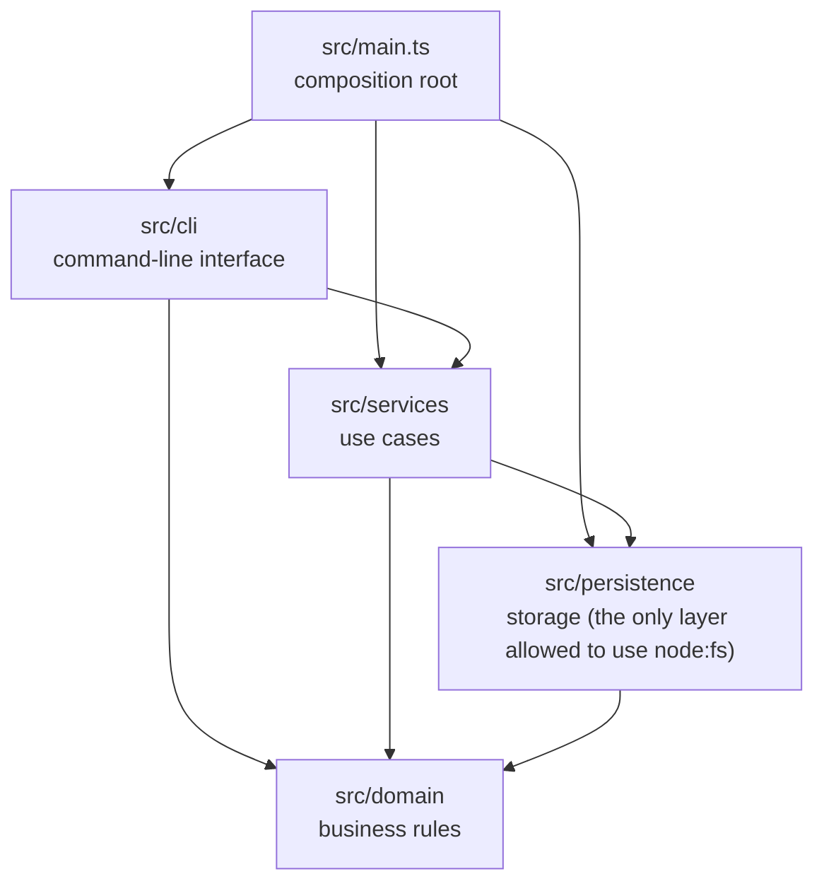

# Architecture rules

## The layers

Arrows show the only allowed import directions.

| Layer | Folder | Allowed to import | Responsibility |
| --- | --- | --- | --- |
| composition root | `src/main.ts` | everything | Create concrete objects and wire them together |
| cli | `src/cli/` | services, domain | Parse arguments, print results |
| services | `src/services/` | persistence, domain | Use cases: add, complete, list, stats |
| persistence | `src/persistence/` | domain | Read and write storage |
| domain | `src/domain/` | nothing | Data types and business rules |

## The rules

| Rule id | In plain English | Why |
| --- | --- | --- |
| `storage-access` | Only `src/persistence` may import `fs`, `node:fs`, `node:fs/promises` or `node:sqlite`. | One place knows the storage format and location. Changing storage changes one folder. Everything else can be tested without a disk. |
| `layer-dependency` | A layer may only import the layers listed above. | Keeps business rules independent of the interface and of storage, and prevents tangled, circular code. |
| `public-entry` | Another layer must be imported through its `index.ts`. | Each layer decides what is public. Internals can change without breaking callers. |
| `unassigned-file` | Every file under `src/` must belong to a layer. | New folders cannot quietly sit outside the rules. Adding a layer is a deliberate, reviewed change. |

The rules are data in [`tools/architecture/rules.ts`](../tools/architecture/rules.ts).
The checker is [`tools/architecture/check.ts`](../tools/architecture/check.ts).

## How the check works

1. Read every `.ts` file under `src/`.
2. Use the TypeScript compiler's pre-processor (`ts.preProcessFile`) to list
   every `import`, `import type`, `export … from`, dynamic `import()` and
   `require()` — with line numbers.
3. Work out which layer the file is in and which layer each import points to.
4. Compare against the rules. Report each violation with the file, line, rule
   and a suggested fix.

It runs in two places:

- `npm run check:architecture` — human-readable report (and GitHub
  annotations in CI).
- `npm run test:architecture` — the same logic as Vitest tests, including
  tests that feed in deliberately bad code to prove each rule fires.

## What it does not catch

Being honest about limits matters more than looking complete:

- **Indirect access.** If persistence exported a function that returns the raw
  file path and the CLI then shelled out to `cat`, the import rule would not
  see it. Review still matters.
- **Computed imports.** `require(someVariable)` cannot be resolved statically.
  (Lint rules and review cover this; it is rare in TypeScript.)
- **Other storage libraries.** Only modules in `STORAGE_MODULES` are treated
  as storage. Adding a database driver means adding it there — and the
  dependency policy forces that conversation anyway, because the new package
  must be approved.

## Changing a rule

Rules are not sacred; they are decisions, and decisions can change. To change
one:

1. Write or update an ADR in `docs/adr/` explaining the new decision.
2. Edit `tools/architecture/rules.ts` and the tests in
   `tests/architecture/architecture.test.ts`.
3. Open a PR with a `## Guardrail change justification` section. PR validation
   requires it, and `CODEOWNERS` requires a maintainer's approval.

What is not acceptable is changing a rule *in order to* get a feature PR
through CI. That is exactly the shortcut the check exists to prevent.
